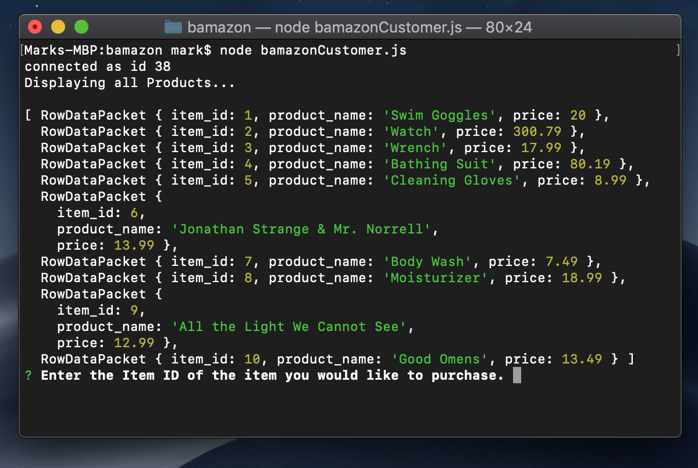
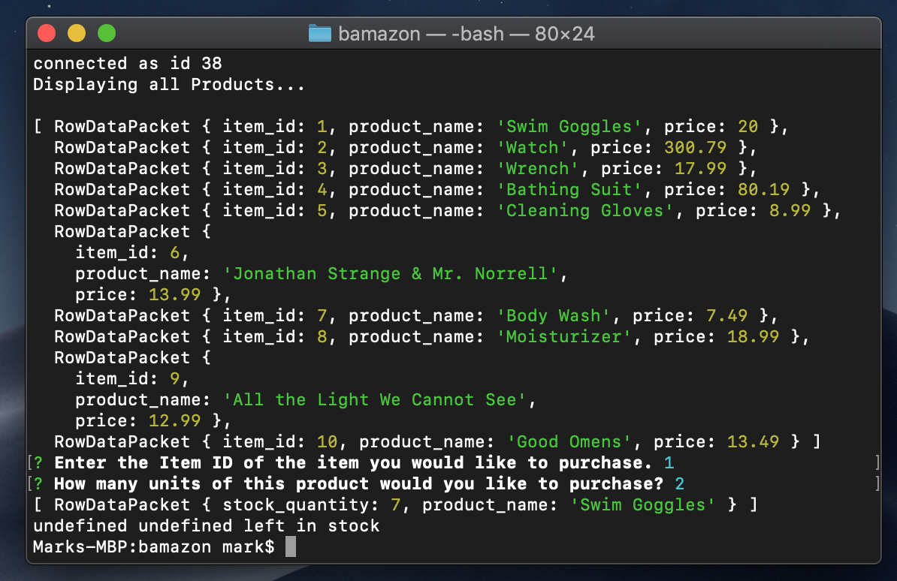

# bamazon
Node.js &amp; MySQL

bamazon is a store front from which you can select items for purchase. 
Once bamazon is run, find the id of the item you would like to order and enter that id when prompted. Then, enter the quanity you would like to buy of the item. 
bamazon will then either let you know if your item is in stock and provide you with an order total or notify you if there is not enough stock to fulfill your order. 

